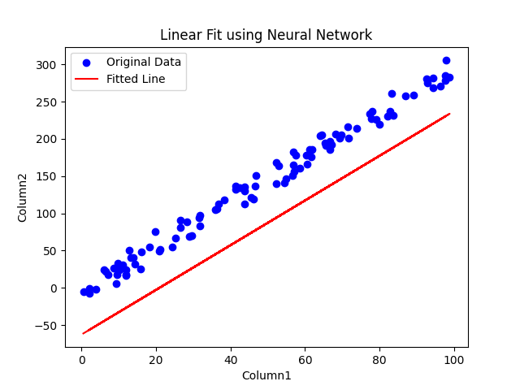
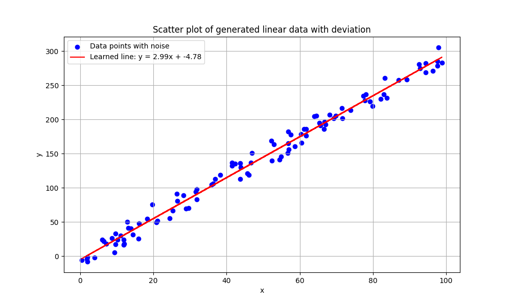
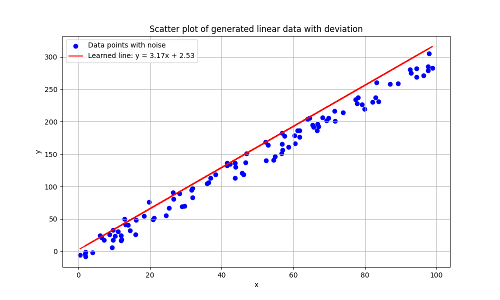
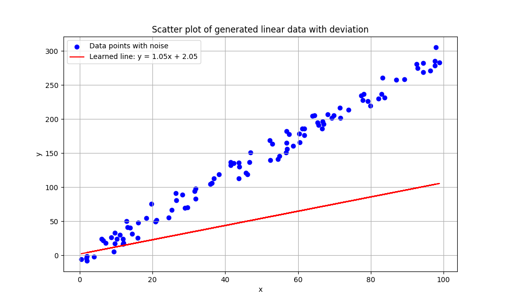

<h1>Machine Learning Notes</h1>

WFD

## Getting Started With Python
! python interpreter not installed 
1. Installed python from internet
2. C:\Users\rodne\AppData\Local\Programs\Python\Python312
3. Setup Path (Edit System Environment)
4. Python Extension for VS Code

! markdown preview does not work properly
Installed Markdown Preview Enhanced and Markdown All In One

### Create Local Python Environment

```dos
python -m venv env
```
Run the command above and close the terminal and open it again as command prompt

```output
Microsoft Windows [Version 10.0.22631.3672]
(c) Microsoft Corporation. All rights reserved.

(env) C:\Rodney\rodney\torch>
```
(env) needs to be added before the prompt

### Install matplotlib and pandas
```
pip install matplotlib
pip install pandas
pip install numpy
pip install torch
```

## What is Machine Learning
✔️😄 By given experiment data (input/output) as training data, create a model, and then use the model to predict data
[ML definition from ChatGPT](ml.md)

## What is a model?

1. I have experiment data
2. Create model
3. Predict future



👍😄 **Conclusion**
1. Model is way off

*[Generate Linear Data](../src/genLinear.py)
$$y=f(x)=3 \cdot x - 7 + noise$$
*[Plot Linear Data](../src/plotLinear.py)
*[Create Linear Model](../src/linearModel1.py)

Epoch 200 Lr 5

Epoch 20 Lr 5

Epoch 200 Lr 0.01


👍😄 **Conclusion**
1. lr is learning rate, which can be adjusted
2. Epoch can be adjusted (number of training times)
3. model cannot be exactly match with original function
4. Accuracy depends on experiment data

```mermaid
graph LR 

TI[Training Input]
TO[Training Output]
IM(Initial Model)
P[Process]
M(Model)
FI(Future Input)
PO(Predict Output)

TI-->IM
TO-->IM
IM-->P-->M
FI-->M-->PO

classDef start fill:green,stroke:#DE9E1F,stroke-width:2px,color:white;
classDef process fill:#F46624,stroke:#F46624,stroke-width:4px,color:white;
classDef js fill:yellow,stroke:black,stroke-width:2px;
classDef if fill:#EBCD6F,stroke:black,stroke-width:2px;
classDef db fill:#BEBDB7,stroke:black,stroke-width:2px;
classDef end1 fill:red,stroke:#DE9E1F,stroke-width:2px,color:white;

class TI,TO,FI,PO start
class IM js
class P if
class DB db
class M end1
```

## Basic Knowledge
❓What is Matrix?
[Definition](matrix.md)
[]()

❓What is Mean Square Error?
Summation of all error between predicted and actual value squared divided by number of data
[Understand Mean Square Error, math](mse1.md)


❓What is gradient of Mean Square Error in matrix format?
[Understand Mean Square Error, math](mse1.md)
[Understand Learning Raate](../src/mse1.py)
[Understand how to adjust variables](../src/mse2.py)

❓What is Learning Rate in NN? Why it is so sensitive?
[Learning Rate](learningRate.md)
```dos
pip install tensorflow
```

[Understand Learning Rate](../src/learningRate2.py)

## Digit Handwritting Classification

```
(env) C:\Rodney\rodney\torch>pip  install torchvision
```
[Understand Training Process](../src/digits01.py)

```mermaid
graph LR

Model[Model]
init("__init__()")
forward("forward()")
Model --> init & forward

Train[Training]
data(Data Loader)
mod(Model Instance)
loss(Loss Function)
optim(Optimizer)

Train --> data & mod & loss & optim

```


* [](../src/digits02.py)

```mermaid 
graph LR
Prediction[Prediction]
data(Data Loader)
mod(Load Model)
Predict(Predict)

Prediction --> data & mod & Predict
```

[create handwriting](../src/digitGenerator.py)
